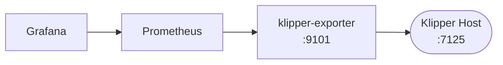

# Getting Started

## Overview

The Prometheus Klipper Exporter collects operational metrics from [Klipper](https://www.klipper3d.org/)
3D printer firmware via the [Moonraker API](https://moonraker.readthedocs.io/) and
exposes them in Prometheus format for monitoring, alerting, and dashboarding with Grafana.

The exporter implements the [Multi-Target Exporter Pattern](https://prometheus.io/docs/guides/multi-target-exporter/)
so a single exporter instance can collect metrics from multiple Klipper hosts.

## Architecture



- **Exporter metrics** are served from `/metrics` (scrape the exporter itself)
- **Klipper metrics** are served from `/probe?target=<host>` (one target per scrape)

## Quick Start

### 1. Start the exporter

```sh
$ prometheus-klipper-exporter
INFO[0000] Beginning to serve on port :9101
```

### 2. Configure Prometheus

Add a scrape job to your `prometheus.yml`:

```yaml
scrape_configs:
  - job_name: "klipper"
    scrape_interval: 5s
    metrics_path: /probe
    static_configs:
      - targets: [ 'klipper-host:7125' ]
    params:
      modules:
        - process_stats
        - job_queue
        - system_info
        - network_stats
        - directory_info
        - printer_objects
        - history
    relabel_configs:
      - source_labels: [__address__]
        target_label: __param_target
      - source_labels: [__param_target]
        target_label: instance
      - target_label: __address__
        replacement: klipper-exporter:9101
```

### 3. Monitor multiple hosts

Add multiple entries to the `static_configs.targets` list:

```yaml
    static_configs:
      - targets:
        - 'klipper-host-1:7125'
        - 'klipper-host-2:7125'
```

### 4. Multi-printer with relabeling

If you have multiple printers on the same Klipper host, use `@` notation and relabeling:

```yaml
    static_configs:
      - targets:
        - 'klipper-host-1:7125@Ender-3-V2'
        - 'klipper-host-1:7125@Ender-3-Pro'
    relabel_configs:
      - source_labels: [__address__]
        regex: '(.*)@.*'
        replacement: $1
        target_label: __param_target
      - source_labels: [__address__]
        regex: '.*@(.*)'
        replacement: $1
        target_label: printer
```

## Next Steps

- [Installation](./installation) — systemd service, Docker deployment
- [Configuration](./configuration) — modules, CLI flags, logging
- [Authentication](./authentication) — API key setup
- [Metrics Reference](/metrics/) — full list of exported metrics
