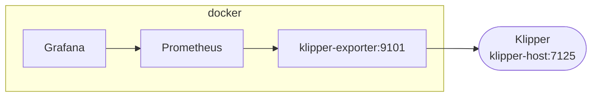

Example docker deployment
=========================

Example deployment of Grafana, Prometheus and the prometheus-klipper-exporter for
collecting and viewing the 3d printer metrics that can be deployed using docker compose.

I recommend running Prometheus/Grafana on a separate host from Klipper. If you
are running on a Raspberry Pi or similar device you should consider configuring the
docker volumes to use external storage on either a connected USB drive, or
network attached storage, to avoid the consistent writes to the SD Card which can
reduce the lifespan of the card.



The [`docker-compose.yml`](./docker-compose.yml) stack defines three containers.

| container | port | link |
| --------- | ---- | ---- |
| `grafana`   | `3000` | http://localhost:3000 |
| `prometheus`| `9090` | http://localhost:9090 |
| `klipper-exporter` | `9101` | - |

Modify [`prometheus.yml`](./prometheus.yml) to set the hostname or ip address of
the klipper host.

```yml
    ...
    static_configs:
      - targets: [ 'klipper-host:7125' ]
    ...
```

Deployment
----------

```sh
$ docker compose up
...
Attaching to grafana, klipper-exporter, prometheus
...
klipper-exporter  | msg="Beginning to serve on port :9101"
prometheus        | msg="Starting Prometheus Server" 
...
grafana           | msg="Starting Grafana" 
...
klipper-exporter  | msg="Starting metrics collection of [process_stats network_stats system_info job_queue directory_info printer_objects] for klipper.home.lan:7125"
klipper-exporter  | msg="Collecting process_stats for klipper.home.lan:7125"
klipper-exporter  | msg="Collecting directory_info for klipper.home.lan:7125"
klipper-exporter  | msg="Collecting job_queue for klipper.home.lan:7125"
klipper-exporter  | msg="Collecting system_info for klipper.home.lan:7125"
klipper-exporter  | msg="Collecting printer_objects for klipper.home.lan:7125"
...
```

Usage
-----

### Prometheus

Check that prometheus is connected to the klipper exporter and collecting metrics.

[http://localhost:9090/targets](http://localhost:9090/targets)


Graph specific metrics directly in prometheus

e.g. [http://localhost:9090/graph](http://localhost:9090/graph?g0.expr=klipper_extruder_temperature&g0.tab=0&g0.stacked=0&g0.show_exemplars=0&g0.range_input=5m)


### Grafana

Add a data source for Prometheus. From withing the docker compose stack the
prometheus container can be referneced directly as `http://prometheus:9090`

[http://localhost:3000/datasources](http://localhost:3000/datasources)

Sign in as `admin` using the initial password set in the `docker-compose.yml`
file before creating a new data source.


Use the new datasource to explore the metrics and create dashboards.


Example Dashboard
-----------------

An example dashboard is included at [`grafana-dashboard.json`](./grafana-dashboard.json).
Open http://localhost:3000/dashboard/import and select "Upload JSON file". Select
the Prometheus data source and click "Import".


Thanks to @danilodorgam there is also an alternative example dashboard published
on grafana.com

- Dashboard [`18467`](https://grafana.com/grafana/dashboards/18467-klipper-dashboard/).


Known Issues
------------

### Unable to resolve local klipper hostname

If you are running klipper-exporter in docker and get a `no such host` simialar
to the below message it is because the container is unable to resolve local
network hostnames.

```text
klipper-exporter  | time="2022-10-14T10:03:25Z" level=error msg="Get \"http://klipper.home.lan:7125/machine/proc_stats\": dial tcp: lookup klipper.home.lan on 127.0.0.11:53: no such host"
```

Modify the `docker-compose.yml` to add the `dns` entry for the `klipper-exporter`
with the IP address of the local network gateway, or local dns server.

```yml
  klipper-exporter:
    hostname: klipper-exporter
    image: ghcr.io/scross01/prometheus-klipper-exporter:latest
    container_name: klipper-exporter
    restart: unless-stopped
    expose:
      - 9101
    dns:
      - 192.168.1.1
```
